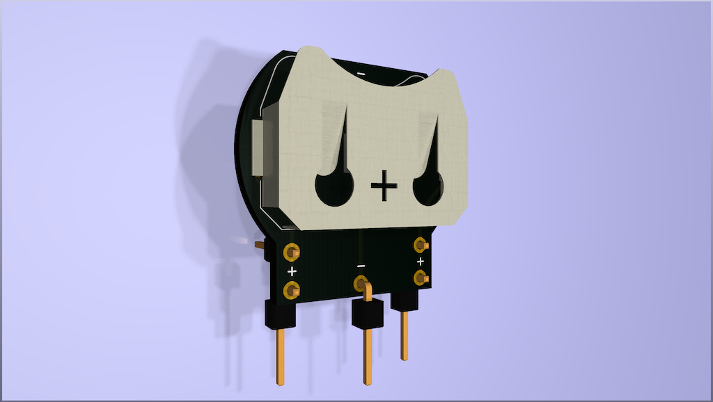

MVS Battery Holder
==================

The original rechargeable battery on SNK Neo Geo MVS MV1B and MV1C boards should be replaced if it either doesn't hold a charge or before it leaks and destroys one or more vital PCB traces.

The original battery was either marked VG2430 or IVR2430 and the problem is that the solder legs use a spacing that no other battery or holder seems to have. Rather than hack something together here is a simple PCB that is spaced correctly and allows you to use most 3V 2032-sized coin cells.

For rechargeable coin cells, an LIR2032 seems a good choice as it outputs 3.6V and needs around 4V for charging which matches what the MVS charging circuit provides. An ML2032 only provides 3V and needs around 2.8-3.3V for charging so chances are the MVS charging circuit would damage the battery.

If you use a non-rechargeable CR2032 coin cell you must disable the charging circuit entirely on the MVS board otherwise this will damage the battery.

The BOM is simply a Keystone 3034 coin cell holder which should be easy to source. If you want to mount the PCB horizontally use three straight header pins, and if you want to mount the PCB vertically use three right-angled header pins.

